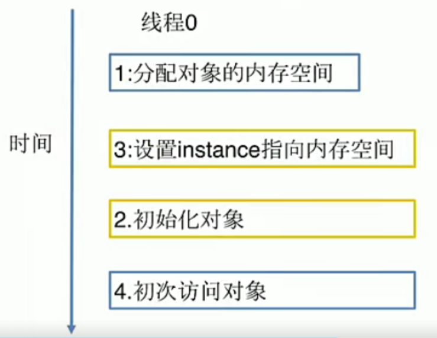
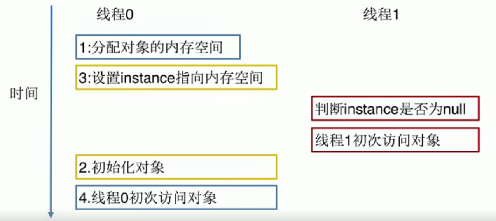
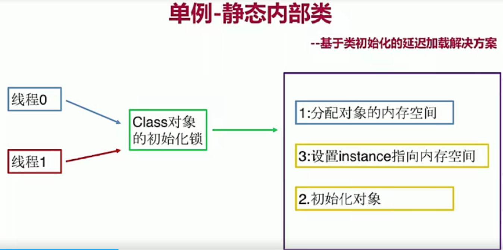

# JavaPatternProject

java模式学习手记

### 1.UML
UML 2.2中一共定义了14种图示，分类如下:
* 结构式图形：强调的是系统式的建模   
* 行为式图形：强调系统模型中触发的事件
* 交互式图形：属于行为式图形子集合，强调系统模型中资料流程

#### 1.1 结构式图形
1. 静态图(类图，对象图，包图)
2. 实现图(组件图，部署图)
3. 剖面图
4. 复合结构图

#### 1.2 行为式图形
1. 活动图
2. 状态图
3. 用例图

#### 1.3 交互式图形
1. 通信图
2. 交互概述图(UML 2.0)
3. 时序图(UML 2.0)
4. 时间图(UML 2.0)

### 2.六大原则
* 开闭原则
* 依赖倒置原则
* 单一职责原则
* 接口隔离原则
* 迪米特法则(最少知道原则)
* 里氏替换原则
* 合成/复用原则(组合/复用原则)

#### 2.1 开闭原则
定义：一个软件实体如类、模块和函数应该对扩展开放，对修改关闭 
用抽象构架框架，用实现扩展细节 
优点：提高软件系统的可复用性及可维护性

#### 2.2 依赖倒置原则
定义：高层模块不应该依赖底层模块，二者都应该依赖其抽象 
针对接口编程，不要针对实现编程 
优点：可以减少类间的耦合性，提高系统稳定性，提高代码可读性和可维护性，可降低修改程序所造成的风险 

#### 2.3 单一职责原则
定义：不要存在多于一个导致类变更的原因 
一个类/接口/方法只负责一项职责 
优点：降低类的复杂度、提高类的可读性，提供系统的可维护性、降低变更引起的风险。

#### 2.4 接口隔离原则
定义：用多个专门的接口，而不使用单一的总接口，客户端不应该依赖它不需要的接口 
一个类对一个类的依赖应该建立在最小的接口上 
建立单一接口，不要建立庞大臃肿的接口 
尽量细化接口，接口中的方法尽量少 
注意适度原则，一定要适度 
优点：符合我们常说的高内聚低耦合的设计思想，从而使得类具有很好的可读性、可扩展性和可维护性。

#### 2.5 迪米特法则(最少知道原则)
定义：一个对象应该对其他对象保持最少的了解。又叫最少知道原则 
尽量降低类与类之间的耦合 
优点：降低类之间的耦合

#### 2.6 里氏替换原则
定义：如果对每一个类型为T1的对象o1，都有类型为T2的对象o2,使得以T1定义的所有程序P在所有的对象o1都替换成o2时，程序P的行为没有发生变化，那么类型T2是类型T1的子类。
 
定义扩展：一个软件实体如果适用一个父类的话，那一定适用于其子类，所有引用父类的地方必须能透明地使用其子类的对象，子类对象能够替换父类对象，而程序逻辑不变。
 
引申意义：子类可以扩展父类的功能，但不能改变父类原有的功能。
* 含义1：子类可以实现父类的抽象方法，但不能覆盖父类的非抽象方法
* 含义2：子类中可以增加自己特有的方法
* 含义3：当子类的方法重载父类的方法时，方法的前置条件(即方法的输入/入参)要比父类方法的输入参数更宽松
* 含义4：当子类的方法实现父类的方法时(重写/重载或实现)，方法的后置条件(即方法的输出/返回值)要比父类更严格或相等

优点1：约束继承泛滥，开闭原则的一种提现
 
优点2：加强程序的健壮性，同时变更时也可以做到非常好的兼容性，提高程序的维护性、扩展性。降低需求变更时引入的风险。

#### 2.7 合成/复用原则(组合/复用原则)
定义：尽量使用对象组合/聚合，而不是继承关系达到软件复用的目的 
聚合has-A 组合contains-A 继承is-A 
优点：可以使系统更加灵活，降低类与类之间的耦合度，一个类的变化对其他类造成的影响相对较少
 

### 3.二十三种设计模式
<h4>创建型设计模式</h4>
就是创建对象的模式，抽象了实例化的过程。关注的是对象的创建，创建型模式将创建对象的过程进行了抽象，也可以理解为将创建对象的过程进行了封装。作为客户程序仅仅需要去使用对象，而不用关心创建对象过程中的逻辑。
#### 3.1 工厂方法
定义：定义一个创建对象的接口，但让实现这个接口的类来决定实例化哪个类，工厂方法让类的实例化推迟到子类中进行。
 
适用场景：
* 创建对象需要大量重复的代码
* 客户端(应用层)不依赖于产品类实例如何被创建、实现等细节
* 一个类通过其子类来指令创建哪个对象

优点：
* 用户只需要关心所需产品对应的工厂，无需关心创建细节
* 加入新产品符合关闭原则，提高扩展性

缺点：
* 类的个数容易过多，增加复杂度
* 增加了系统的抽象性和理解难度

#### 3.2 抽象工厂
定义：抽象工厂模式提供一个创建一系列相关或相互依赖对象的接口 
无须指定它们具体的类 
适用场景：
* 客户端(应用层)不依赖于产品类实例如何被创建、实现等细节
* 强调一系列相关的产品对象(属于同一产品族)一起使用创建对象需要大量重复的代码
* 提供一个产品类的库，所有的产品以同样的接口出现，从而使客户端不依赖于具体实现

优点：
* 具体产品在应用层 代码隔离，无须关心创建细节
* 将一个系列的产品族捅一到一起创建

缺点：
* 规定了所有可能被创建的产品集合，产品族中扩展新的产品困难，需要修改抽象工厂的接口
* 增加了系统的抽象性和理解难度

#### 3.3 建造者
定义：将一个复杂对象的构建与它的表示分离，使得同样的构建过程以创建不同的表示 
用户只需置顶需要建造的类型就可以得到它们，建造过程及细节不需要知道 
适用场景
* 如果一个对象有非常复杂的内部结构(很多属性)
* 想把复杂对象的创建和使用分离

优点：
* 封装性好，创建和使用分离
* 扩展性好、建造类之间独立、一定程度上解耦

缺点：
* 产生多余的Builder对象
* 产品内部发生变化，建造者都要修改，成本较大

#### 3.4 单例模式
定义：保证一个类仅有一个实例，并提供一个全局访问点 
适用场景：
* 想确保任何情况下都绝对只有一个实例

优点：
* 在内存里只有一个实例，减少了内存开销
* 可以避免对资源的多重占用
* 设置全局访问点，严格控制访问

缺点：
* 没有接口，扩展困难

单线程 

多线程 

静态内部类 

#### 3.5 原型模式
定义：指原型实例指定创建对象的对象，并且通过拷贝这些原型创建新的对象 
不需要知道任何创建的细节，不调用构造函数 

适用场景：
* 类初始化消费较多资源
* new 产生的一个对象需要非常繁琐的过程(数据准备、访问权限等)
* 构造函数比较复杂
* 循环体中生产大量对象时

优点：
* 原型模式性能比直接new 一个对象性能高
* 简化创建过程

缺点：
* 必须配备克隆方法
* 对克隆复杂对象或对克隆出的对象进行复杂拷贝
* 深拷贝、浅拷贝要运用得当

<h4>结构型模式</h4>
解决怎样组装现有的类，设计他们的交互方式，从而达到实现一定功能的目的。
#### 3.6 外观模式
定义：又叫门面模式，提供了一个统一的接口，用来访问子系统中的一群接口 
外观模式定义了一个高层接口，让子系统更容易使用 

适用场景：
* 子系统越来越复杂，增加外观模式提供简单调用接口
* 构建多层系统结构，利用外观对象作为每层的入口，简化层间调用

优点：
* 简化了调用过程，无需了解深入子系统，防止带来风险
* 减少系统依赖，松散耦合
* 更好的划分访问层次
* 符合迪米特法则，即最少知道原则

缺点：
* 增加子系统，扩展子系统行为容易引入风险
* 不符合开闭原则

#### 3.7 装饰者模式
定义：在不改变原有对象的基础之上，将功能附加到对象上 
提供了比继承更有弹性的替代方案(扩展原有对象功能) 

适用场景：
* 扩展一个类的功能或给一个类添加附加职责
* 动态的给一个对象添加功能，这些功能可以再动态的撤销

优点：
* 继承的有力补充，比继承灵活，不改变原有对象的情况下给一个对象扩展功能
* 通过使用不同装饰类以及这些装饰类的排列组合，可以实现不同效果
* 符合开闭原则

缺点：
* 会出现更多的代码，更多的类，增加程序复杂性
* 动态装饰时，多层装饰时会更复杂

#### 3.8 适配器模式
定义：将一个类的接口转换成客户期望的另一个接口 
使原本接口不兼容的类可以一起工作 

适用场景：
* 已经存在的类，它的方法和需求不匹配时(方法结果相同或相似)
* 不是软件设计阶段考虑的设计模式，是随着软件维护，由于不同产品、不同厂商造成功能类似而接口不相同情况下的解决方案

优点：
* 能提高类的透明性和复用，现有的类复用但不需要改变
* 目标类和适配器类解耦，提高程序扩展性
* 符合开闭原则

缺点：
* 适配器编写过程需要全面考虑，可能会增加系统的复杂性
* 增加系统可读代码难度

扩展：
* 对象适配器
* 类适配器

#### 3.9 享元模式
定义：提供了减少对象数量从而改善应用所需的对象结构的方式 
运用共享技术有效地支持大量细粒度的对象 

适用场景：
* 常常应用于系统底层的开发，以便解决系统的性能问题
* 系统有大量的相似对象，需要缓冲池的场景

优点：
* 减少对象的创建，降低内存中对象的数量，降低系统的内存，提高效率
* 减少内存之外的其他资源占用

缺点：
* 关注内部/外部的状态，关注线程安全问题
* 使系统、程序的逻辑复杂化

扩展
* 内部状态
* 外部状态

#### 3.10 组合模式
定义：将对象组合成树形结构以表示“部分-整体”的层次结构 
使客户端对单个对象和组合对象保持一致的方式处理 

适用场景：
* 希望客户端可以忽略组合对象和单个对象的差异时
* 处理一个树形结构时

优点：
* 清楚地定义分层次的复杂对象，表示对象的全部或部分层次
* 让客户端忽略了层次的差异，方便对整个层次结构进行控制
* 简化客户端代码
* 符合开闭原则

缺点：
* 限制类型时会较为复杂
* 使设计变得更加抽象

#### 3.11 桥接模式
定义：将抽象部分与它的具体实现部分分离，使它们都可以独立的变化 
通过组合的方式建立两个类之间联系，而不是继承 

适用场景：
* 抽象和具体实现之间增加更多的灵活性
* 一个类存在两个或多个独立变化的维度，且这两个或多个维度都需要独立进行扩展
* 不希望使用继承，或因为多层继承导致系统类的个数剧增

优点：
* 分离抽象部分及其具体实现部分
* 提高了系统的可扩展性
* 符合开闭原则
* 符合合成复用原则

缺点：
* 增加了系统的理解与设计难度
* 需要正确地识别出系统中两个独立变化的维度

#### 3.12 代理模式
定义：为其他对象提供一种代理，以控制对这个对象的访问 
代理对象在客户端和目标对象之间起到中介的作用 

适用场景：
* 保护目标对象
* 增强目标对象

优点：
* 代理模式能将代理对象与真实被调用的目标对象分离
* 一定程度上降低了系统的耦合度，扩展性好
* 保护目标对象
* 增强目标对象

缺点：
* 代理模式会造成系统设计中类的数目增加
* 在客户端和目标对象增加一个代理对象，会造成请求处理速度慢
* 增加系统的复杂度

扩展：
* 静态代理
* 动态代理
* CGLib代理

<h4>行为型设计模式</h4>
描述了对象和类的模式，以及它们之间的通信模式。行为型模式刻画了在程序运行时难以跟踪的复杂控制流，可分为行为类模式和行为对象模式；
1. 行为模式使用继承机制在类间分派行为
2. 行为对象模式使用对象聚合来分配行为。一些行为对象模式描述了一组对等的对象，怎样相互协作以完成其中任何一个对象都无法单独完成的任务。
#### 3.13 模板模式
定义：定义了一个算法的骨架，并允许子类为一个或多个步骤提供实现 
模板方法使得子类可以在不改变算法结构的情况下，重新定义算法的某些步骤 

适用场景：
* 一次性实现一个算法的不变的部分，并将可变的行为留给子类来实现
* 各子类中公共的行为被提取出来并集中到一个公共父类中，从而避免代码重复

优点：
* 提高复用性
* 提高扩展性
* 符合开闭原则

缺点：
* 类数目增加
* 增加了系统实现的复杂度
* 继承关系自身缺点，如果父类添加新的抽象方法，所有子类都要改一遍

扩展：
* 钩子方法

#### 3.14 迭代器模式
定义：提供一种方法，顺序访问一个集合对象中的各个元素，而又不暴露该对象的内部表示 

适用场景:
* 访问一个集合对象的内容而无需暴露它的内部表示
* 为遍历不同的集合 结构提供一个统一的接口

优点：
* 分离了集合对象的遍历行为

缺点：
* 类的个数成对增加

#### 3.15 策略模式
定义：定义了算法家族，分别封装起来，让它们之间可以互相替换，此模式让算法的变化不会影响到使用算法的用户 

适用场景:
* 系统有很多类，而他们的区别仅仅在于他们的行为不同
* 一个系统需要动态地在几种算法中选择一种

优点：
* 开闭原则
* 避免使用多重条件转移语句
* 提高算法的保密性和安全性

缺点：
* 客户端必须知道所有的策略类，并自行决定使用哪一个策略类
* 产生很多策略类

#### 3.16 解释器模式
定义：给定一个语言，定义它的文法的一种表示，并定义一个解释器，这个解释器使用该表示来解释语言中的句子 
为了解释一种语言，而为语言创建的解释器 

适用场景:
* 某个特定类型问题发生频率足够高

优点：
* 语法由很多类表示，容易改变及扩展此“语言”

缺点：
* 当语法规则数目太多时，增加了系统复杂度

#### 3.17 观察者模式
定义：定义了对象之间的一对多依赖，让多个观察者对象同时监听某一个主题对象，当主题对象发生变化时，它的所有依赖者(观察者)都会接到通知并更新 

适用场景:
* 关联行为场景，建立一套触发机制

优点：
* 观察者和被观察者之间建立一个抽象的耦合
* 观察者模式支持广播通信

缺点：
* 观察者之间有过多的细节依赖，提高时间消耗及程序复杂度
* 使用要得当，要避免循环调用

#### 3.18 备忘录模式
定义：保存一个对象的某个状态，以便在适当的时候恢复对象 

适用场景:
* 保存及恢复数据相关业务场景
* 后悔的时候，即想恢复到之前的状态

优点：
* 为用户提供一种可恢复机制
* 存档信息的封装

缺点：
* 资源占用

#### 3.19 命令模式
定义：将“请求”封装成对象，以便使用不同的请求 
命令模式解决了应用程序中对象的职责以及它们之间的通信方式 

适用场景:
* 请求调用者和请求接收者需要解耦，使得调用者和接收者不直接交互
* 需要抽象出等待执行的行为

优点：
* 降低耦合
* 容易扩展新命令或者一组命令

缺点：
* 命令的无线扩展会增加类的数量，提高系统实现复杂度

#### 3.20 中介者模式
定义：定义一个封装一组对象 如何交互的对象 
通过使对象明确地相互引用来促进松散耦合，并允许独立地改变它们的交互 

适用场景:
* 系统中对象之间存在复杂的引用关系，产生的相互依赖关系结构混乱且难以理解
* 交互的公共行为，如果需要改变行为则可以增加新的中介者类

优点：
* 将一对多转化成一对一、降低程序复杂度
* 类之间解耦

缺点：
* 中介者过多，导致系统复杂

#### 3.21 责任链模式
定义：为请求创建一个接收此次请求对象的链 

适用场景:
* 一个请求的处理需要多个对象当中的一个或几个协作处理

优点：
* 请求的发送者和接收者(请求的处理)解耦
* 责任链可以动态组合

缺点：
* 责任链太长或者处理时间过长，影响性能
* 责任链有可能过多

#### 3.22 访问者模式
定义：封装作用于某数据结构(如List/Set/Map等)中的各元素的操作 
可以在不改变各元素的类的前提下，定义作用于这些元素的操作 

适用场景:
* 一个数据结构(如List/Set/Map等)包含很多类型对象
* 数据结构与数据操作分离

优点：
* 增加新的操作很容易，即增加一个新的访问者

缺点：
* 增加新的数据结构困难
* 具体元素变更比较麻烦

#### 3.23 状态模式
定义：允许一个对象在其内部状态改变时，改变它的行为 

适用场景:
* 一个对象存在多个状态(不同状态下行为不同)，且状态可相互转换

优点：
* 将不同的状态隔离
* 把各种状态的转换逻辑，分布到State的子类中，减少相互间依赖
* 增加新的状态非常简单

缺点：
* 装太多的业务场景导致类数目增加，系统变复杂